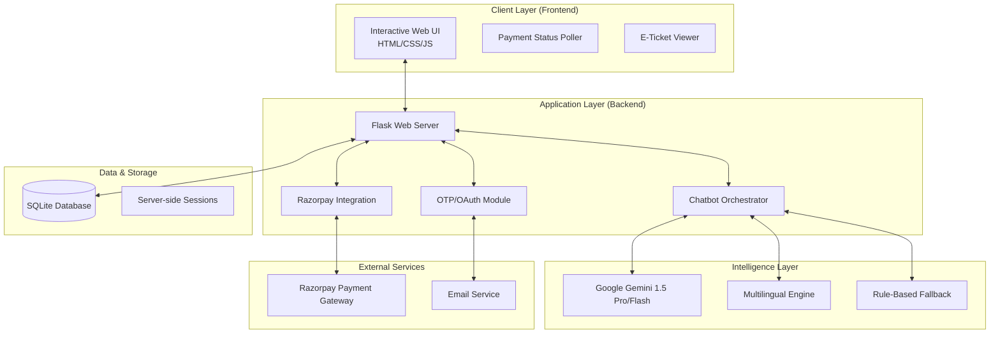

# 🏛️ Museum AI Chatbot: System Architecture

This document provides a comprehensive technical overview of the **Museum AI Chatbot (Heritage Guide)** system. The architecture is designed for high availability, multilingual accessibility, and seamless financial transactions in a production environment.

---

## 🏗️ High-Level Architecture

The system follows a **N-Tier Architecture** pattern, separating the presentation layer, application logic, and data persistence.

---

## 🧩 Component Breakdown

### 1. **Core Backend (Flask)**
*   **Role**: Serves as the central nervous system.
*   **Key Features**:
    *   **Session Management**: Maintains user conversation states and booking progress.
    *   **Security**: Implements OTP-based verification and Google OAuth for secure visitor entry.
    *   **API Gateway**: Exposes endpoints for chat, payment status, and ticket generation.

### 2. **Intelligence Orchestrator (`chatbot_engine.py`)**
A hybrid AI system that balances the creativity of LLMs with the reliability of rule-based logic.
*   **Generative Layer**: Utilizes **Google Gemini (1.5 Flash/Pro)** for natural language understanding and heritage knowledge.
*   **Priority Model Selection**: Automatically pings and selects the best available Gemini model to ensure zero downtime.
*   **State Machine**: A deterministic flow for ticket bookings:
    `Idle` ➔ `Exhibition Selection` ➔ `Visit Date` ➔ `Ticket Count` ➔ `Tier Selection` ➔ `Payment`.
*   **Language Engine**:
    *   **Auto-Detection**: Uses `langdetect` and regional keyword matching.
    *   **Script Enforcement**: Handles both **Native script** (e.g., Hindi) and **Latin script** (Hinglish/Tanglish).

### 3. **Payment & Fintech Integration**
*   **Gateway**: Razorpay API.
*   **QR Logic**: Dynamically generates verified UPI QR codes to prevent security flags in consumer apps like GPay.
*   **Real-time Verification**: A backend-to-backend polling mechanism verifies transaction finality without requiring manual user input.

### 4. **Frontend Aesthetics**
*   **Design System**: Glassmorphism aesthetic using high-contrast typography (Inter/Outfit).
*   **Responsiveness**: Mobile-first design for visitors scanning on-site.
*   **Interactive Components**: Vanilla JS chat interface with markdown rendering and dynamic ticket downloads.

---

## 🔄 Data Flows

### A. Message Processing Flow
1. User sends a message in any of the 10 supported languages.
2. `ChatbotEngine` detects language and script.
3. System checks if message triggers a state transition (e.g., "book ticket").
4. If conversational, Gemini AI processes the request using a specialized "Heritage Expert" persona.
5. Response is translated/enforced back to the user's preferred script.

### B. Payment & Booking Flow
1. Chatbot calculates total price based on **Tiered Pricing** (Adult/Student/Group).
2. Backend creates a Razorpay Payment Link.
3. Frontend displays a QR code.
4. User pays; Frontend polls `/check-payment` every 3 seconds.
5. Razorpay Webhook/API confirms payment.
6. Backend generates a unique **Ticket Hash** and updates SQLite.
7. E-Ticket is rendered and offered for download.

---

## 🛠️ Tech Stack

| Layer | Technologies |
| :--- | :--- |
| **Frontend** | HTML5, CSS3 (Glassmorphism), JavaScript (ES6) |
| **Backend** | Python 3.10+, Flask, Gunicorn |
| **AI/ML** | Google Gemini 1.5, Deep-Translator, Langdetect |
| **Database** | SQLite3 (Production-optimized pooling) |
| **Payments** | Razorpay UPI Integration |
| **DevOps** | Docker, Docker Compose, Nginx, Jenkins |
| **Monitoring** | Prometheus, Grafana, Loki |

---

## 📈 Scalability & DevOps
*   **Containerization**: The entire stack is Dockerized for consistent deployment.
*   **Load Balancing**: Nginx acts as a reverse proxy, handling SSL and traffic distribution.
*   **Observability**: Integrated with Prometheus for tracking API latency and Grafana for visualizing booking trends and server health.

---
*Document Version: 1.2.0 | Last Updated: April 2026*
